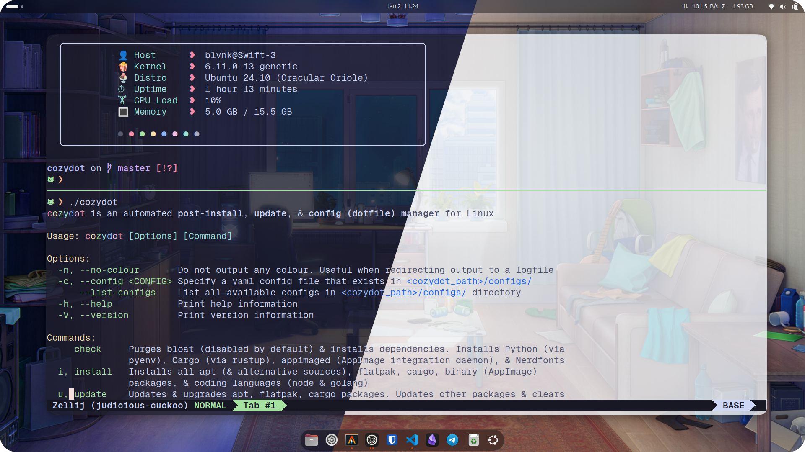

<div align="center"> <!-- use align as CSS is not allowed on GitHub markdown https://github.com/orgs/community/discussions/22728 -->
  <!-- " width=100> <!-- Logo -->
  <h1>cozydot</h1> <!-- Project Name -->
  <p> <!-- Description -->
    cozydot is an automated post-install, update, & config (dotfile) manager for Linux.
  </p>
  <p> <!-- Built With -->
    Built With: <a href="https://github.com/mikefarah/yq">yq</a> &bull; <a href="https://www.gnu.org/s/stow">GNU Stow</a> &bull; <a href="https:catppuccin.com">Catppuccin</a>
  </p>
</div>

---

<details>
<summary>Table of Contents</summary>

- [About](#about)
- [Getting Started](#getting-started)
  - [Prerequisites](#prerequisites)
  - [Installation](#installation)
- [Usage](#usage)
  - [Config Schema](#config-schema)
    - [Metadata](#metadata)
    - [Check](#check)
    - [Install](#install)
    - [Update](#update)
    - [Configure](#configure)
  - [Help Message](#help-message)
  - [Commands to Run on a Fresh Install](#commands-to-run-on-a-fresh-install)
  - [Setting Up Git Credentials](#setting-up-git-credentials)
</details>

## About
<div align="center"></div>

cozydot is an automated post-install, update, & config (dotfile) manager for Linux, with a focus on idempotency & repeatability. Supports Debian-based / Ubuntu-based distros, & GNOME / Cinnamon desktop environments. Riced & themed with [Catppuccin](https://catppuccin.com).

Features:

- More than a post-install scipt. cozydot updates your system & can be run at any time, & not only on fresh installs.
- Latest & greatest packages. cozydot uses 3rd-party apt repos, [Flatpak](https://flatpak.org), [AppImage](https://appimage.org) & [Cargo](https://doc.rust-lang.org/cargo) to deliver up-to-date packages.
- Intuitive config files. cozydot uses customisable YAML files that are easily edited, or use available presets in `./configs/` directory.
- Uses native tools. With the exception of [yq](https://github.com/mikefarah/yq) for querying config files & [GNU Stow](https://www.gnu.org/s/stow) for managing dotfiles, cozydot uses already existing tools to perform each command.

prod by blvnk.

## Getting Started

### Prerequisites

[Git](https://git-scm.com/downloads/linux). Install git with `sudo apt-get install git`.

### Installation

Clone this repository & run cozydot. On the first run, cozydot will install itself in `~/.cozydot`.

```bash
git clone https://github.com/adoreblvnk/cozydot.git && ./cozydot/cozydot
```

## Usage

### Config Schema

#### Metadata

- `.description` *\<string\>*: Config description used in `cozydot --list-configs`

| Value       | Default    | Description                                         |
| ----------- | ---------- | --------------------------------------------------- |
| description | `<string>` | Config description used in `cozydot --list-configs` |
| distro      | auto       |                                                     |
| DE          | auto       |                                                     |

#### Check
| Value              | Default     | Description                                                                                                                          |
| ------------------ | ----------- | ------------------------------------------------------------------------------------------------------------------------------------ |
| distroCfg          | `true`      | Debloats / configures distro before cozydot executes command actions                                                                 |
| purge              | `!disabled` | Uninstalls unneeded / conflicting packages (eg [Docker](https://docs.docker.com)). NOTE: Enable this when running on a fresh install |
| deps               | `!enabled`  | Installs dependencies for other packages (eg Alacritty) from apt. Recommended to leave this enabled to prevent dependency errors     |
| python             | `!enabled`  | Manage Python & [Pip](https://pypi.org/project/pip) via [pyenv](https://github.com/pyenv/pyenv)                                      |
| python.pyenvUpdate | `false`     |                                                                                                                                      |
| python.version     | `latest`    | Python version                                                                                                                       |
| python.pip         | `false`     | Upgrades [Pip](https://pypi.org/project/pip)                                                                                         |
| rustupCheck        | `true`      | Installs [Rustup](https://rustup.rs), the Rust toolchain (Rust, [Cargo](https://doc.rust-lang.org/cargo)) installer                  |
| appimaged          | `true`      | Installs [appimaged](https://github.com/probonopd/go-appimage/tree/master/src/appimaged) (Appimage integration daemon)               |
| nerdfont           | `!enabled`  | Installs [Nerd Fonts](https://www.nerdfonts.com) ([Geist](https://vercel.com/font) Mono by default) which provide glyphs & ligatures |

#### Install
| Value                 | Default    | Description                                                                                                                              |
| --------------------- | ---------- | ---------------------------------------------------------------------------------------------------------------------------------------- |
| check                 | `true`     |                                                                                                                                          |
| apt                   | `!enabled` | Installs essential packages (eg vim). Some packages' (eg yazi) functionality can be extended with these packages installed               |
| addRepos              | `!enabled` | 3rd-party apt repositories ([SourcesList](https://wiki.debian.org/SourcesList))                                                          |
| - sourceName          | `<string>` |                                                                                                                                          |
| - remoteKey           | `<string>` | URL of signing key                                                                                                                       |
| - keyPath             | `<string>` | Path of signing key on machine                                                                                                           |
| - repo                | `<string>` | [SourcesList](https://wiki.debian.org/SourcesList) entry for repo                                                                        |
| - pinning             | `false`    | Edit package priority. If [pinning](https://wiki.debian.org/AptConfiguration) is enabled, paste the contents of the preference file here |
| - packages            | `<list>`   | List of packages to install from this source                                                                                             |
| flatpak               | `!enabled` | Install [Flatpak](https://flatpak.org) packages                                                                                          |
| cargo                 | `!enabled` | Install [Cargo](https://crates.io) packages                                                                                              |
| binaries              | `!enabled` | Install binaries ([AppImage](https://appimage.org) / deb packages)                                                                       |
| - name                | `<string>` | Name of binary. File extension determines if package is an [AppImage](https://appimage.org) or binary (.deb)                             |
| - url                 | `<string>` | Package URL                                                                                                                              |
| languages.goVersion   | `latest`   | Installs latest version of [Go](https://go.dev)                                                                                          |
| languages.nodeVersion | `latest`   | Installs latest version of [Node](https://nodejs.org) via [NVM](https://github.com/nvm-sh/nvm)                                           |

#### Update
| Value             | Default    | Description                                                                                                                             |
| ----------------- | ---------- | --------------------------------------------------------------------------------------------------------------------------------------- |
| check             | `true`     |                                                                                                                                         |
| apt               | `!enabled` | Updates & upgrades apt packages                                                                                                         |
| apt.aptFull       | `false`    | Upgrades the entire system, installing new packages if necessary, & removes old archive files & unused packages with their config files |
| flatpak           | `true`     |                                                                                                                                         |
| cargo             | `false`    |                                                                                                                                         |
| other.yq          | `true`     | Updates [yq](https://github.com/mikefarah/yq) binary                                                                                    |
| other.go          | `false`    | Updates [Go](https://go.dev) to the latest version                                                                                      |
| other.node        | `false`    | Updates [Node](https://nodejs.org) to the latest version via [NVM](https://github.com/nvm-sh/nvm)                                       |
| other.zellijClear | `true`     | Delete all other [Zellij](https://zellij.dev) sessions, including exited ones                                                           |

#### Configure
| Value                         | Default     | Description                                                                                                              |
| ----------------------------- | ----------- | ------------------------------------------------------------------------------------------------------------------------ |
| check                         | `true`      |                                                                                                                          |
| dotfiles                      | `!enabled`  | Dotfile manager implementation via [GNU Stow](https://www.gnu.org/s/stow)                                                |
| dotfiles.stowMode             | `override`  | Override option uses cozydot's dotfiles. Backup option uses original system dotfiles                                     |
| dotfiles.packages             | `<list>`    | List of packages to stow. Directory structure for each package in `dotfiles/` starts from `$HOME` PATH                   |
| apps.alacritty                | `true`      | Setup [Alacritty](https://alacritty.org) adds desktop entry & bash completion                                            |
| apps.docker                   | `true`      | Setup [Docker](https://docs.docker.com) adds user to docker group & uses local logging driver to prevent disk-exhaustion |
| apps.virtualbox               | `true`      | Setup [VirtalBox](https://www.virtualbox.org) adds user to vboxusers group                                               |
| apps.vscodeExtensions         | `!enabled`  | Install [VS Code](https://code.visualstudio.com) extensions                                                              |
| optimisations.auto-cpufreq    | `true`      | Installs / configures [auto-cpufreq](https://github.com/AdnanHodzic/auto-cpufreq), a CPU optimizer                       |
| DE.gnome.settings             | `true`      | Settings config increase screen blank delay to 15 mins, set dark mode                                                    |
| DE.gnome.extensions           | `true`      | Install [GNOME](https://www.gnome.org) extensions                                                                        |
| DE.gnome.defaultTerm          | `alacritty` | Set default terminal                                                                                                     |
| DE.gnome.MacOSDock            | `true`      | Make [Dash to Dock](https://github.com/micheleg/dash-to-dock) mimic MacOS dock behaviour                                 |
| DE.gnome.smoothRoundedCorners | `true`      | Smoothen corners in [Rounded Window Corners Reborn](https://github.com/flexagoon/rounded-window-corners)                 |

### Help Message

Running `./cozydot` outputs a help message as follows.

```
cozydot is an automated post-install, update, & config (dotfile) manager for Linux

Usage: cozydot [Options] [Command]

Options:
  -n, --no-colour       Do not output any colour. Useful when redirecting output to a logfile
  -c, --config <CONFIG> Specify a yaml config file that exists in <cozydot_path>/configs/
      --list-configs    List all available configs in <cozydot_path>/configs/ directory
  -h, --help            Print help information
  -V, --version         Print version information

Commands:
     check     Purges bloat (disabled by default) & installs dependencies. Installs Python (via
               pyenv), Cargo (via rustup), appimaged (AppImage integration daemon), & Nerdfonts
  i, install   Installs all apt (& alternative sources), flatpak, cargo, binary (AppImage)
               packages, & coding languages (node & golang)
  u, update    Updates & upgrades apt, flatpak, cargo packages. Updates other packages & clears
               Zellij cache (see configs/default.yaml for details)
  c, configure Restore / backup dotfiles via Stow (dotfile manager), configures apps installed,
               customise desktop environment (Cinnamon / GNOME)

Configuration:
  Customise each command action by modifying the config (default: configs/default.yaml).
  The full config schema of cozydot is available at README.md.
  Preset configs are available in <cozydot_path>/configs/ directory.
  Add new configs in <cozydot_path>/configs/ or list them with cozydot --list-configs

Example: cozydot --config virtual_machine configure

Project Homepage: https://github.com/adoreblvnk/cozydot
```

### Commands to Run on a Fresh Install

On a fresh install, cozydot is intended to be run sequentially like:

```bash
./cozydot install # includes `check` step by default
./cozydot configure
```

### Setting Up Git Credentials

Fill up your `name`, `email` & `signingkey` (optional) in `/dotfiles/bash/.gitconfig`. Optionally, run `git update-index --assume-unchanged dotfiles/bash/.gitconfig` to avoid committing your secrets to git.

## Credits <!-- omit in toc -->

- [adore_blvnk](https://x.com/adore_blvnk)

## Acknowledgements <!-- omit in toc -->

<!-- Inspired by Best-README-Template (https://github.com/othneildrew/Best-README-Template) -->
<!-- Table of Contents generated by Markdown All in One (https://github.com/yzhang-gh/vscode-markdown) -->
