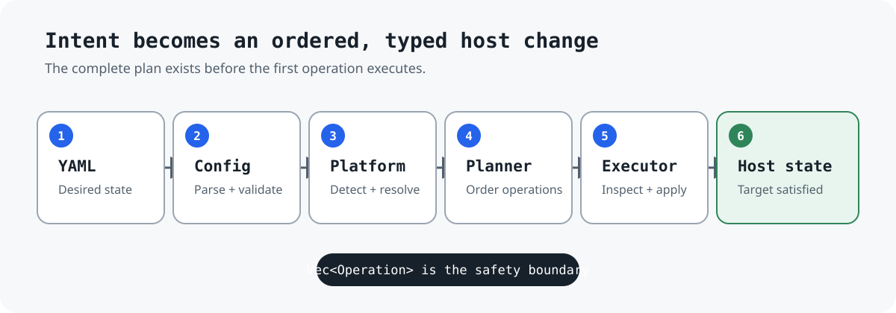
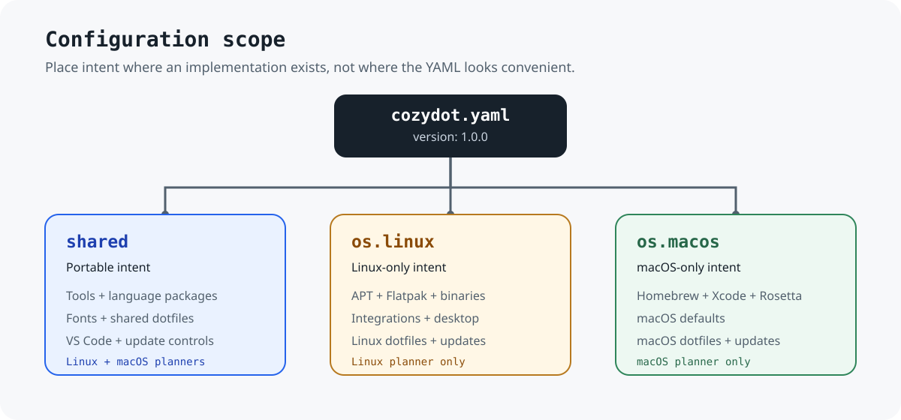

# Cozydot intern onboarding

Cozydot turns one YAML file into a safe, repeatable setup for supported Linux and macOS hosts. It manages packages, language toolchains, dotfiles, integrations, desktop settings, and explicit updates without allowing arbitrary shell commands in the configuration.

This guide explains how to reason about Cozydot before changing it.

## The problem Cozydot solves

A workstation normally accumulates setup steps across package managers, install scripts, copied dotfiles, and manual desktop settings. Those steps are difficult to reproduce and risky to rerun.

Cozydot gives them one lifecycle:

1. Describe the intended host state in `cozydot.yaml`.
2. Parse and validate the complete configuration.
3. Detect and validate the current platform.
4. Plan a complete ordered list of typed operations.
5. Execute each operation through its dedicated executor.
6. Leave already-satisfied state unchanged where the operation is ensure-only.



The important design choice is the boundary between intent and execution. YAML selects supported behavior. It cannot inject commands, shell fragments, plugins, interpolation, or arbitrary paths into the executor.

## Supported hosts

Linux:

- Debian, Ubuntu, Pop!_OS, and Linux Mint
- Debian Bookworm and Trixie; older and untested Debian releases are rejected
- `amd64`, `arm64`, and 32-bit `arm32`
- GNOME and Cinnamon for configured desktop behavior

macOS:

- Apple Silicon (`arm64`)

Unsupported distributions and architectures are rejected instead of being handled through a best-effort fallback.

## The configuration model

The active configuration lives at:

```text
${XDG_CONFIG_HOME:-$HOME/.config}/cozydot/cozydot.yaml
```

Its top-level shape is:

```yaml
version: 1.0.0

shared:
  # Portable behavior used by Linux and macOS.

os:
  linux:
    # Linux-only behavior.
  macos:
    # macOS-only behavior.
```



Use `shared` only for behavior with Linux and macOS implementations. Examples include Rust, Go, Node.js, Python, Cargo and npm packages, Nerd Fonts, shared dotfile packages, VS Code extensions, and their update controls.

Use `os.linux` for APT, Flatpak, Deb and AppImage binaries, Linux integrations, Linux desktop settings, and Linux update policy.

Use `os.macos` for Homebrew, Xcode command line tools, Rosetta, macOS defaults, platform dotfiles, and Homebrew updates.

### Absence, `false`, and active intent

Many controls use `Option<T>` in Rust. For those controls:

- An absent field means Cozydot has no instruction for that state.
- `false` normally means the optional action is disabled or skipped.
- `true` requests the documented action.
- An empty optional list normally plans no work.

Do not generalize this to every field. Some mappings and lists are required by schema. Check the Rust type and its validation before deciding whether omission is valid.

Examples:

```yaml
shared:
  tools:
    rust: stable       # Ensure a stable Rust toolchain exists.
    go: latest         # Ensure the selected Go toolchain exists.
    node: lts          # Ensure the selected Node.js toolchain exists.
    python: "3.13"     # Ensure the selected Python toolchain exists.
```

Official APT source behavior is not configurable. On pure Debian, `apply` and enabled APT updates append `main`, `contrib`, `non-free`, and `non-free-firmware` to matching Bookworm or Trixie source entries. Existing files, URIs, options, comments, and unrelated repositories remain in place. Ubuntu and derivative official sources are unchanged.

### Configuration sources in the repository

- `configs/cozydot.yaml` is the manually maintained base preset.
- `configs/full.yaml`, `configs/cli.yaml`, and `configs/vm.yaml` are generated by `scripts/generate-configs.sh`.
- `build.rs` embeds the presets and bundled dotfiles into the binary.
- `cozydot init` materializes a selected preset and bundled dotfiles without requiring a repository checkout.
- The active file created by `init` is user configuration. It is not regenerated by the repository script.

Edit `configs/cozydot.yaml`, then regenerate derived presets. Do not manually edit generated presets.

## The runtime architecture

The core flow crosses five modules:

1. `src/main.rs`
   - Parses the CLI.
   - Loads the active configuration.
   - Detects the platform for host-changing commands.
   - Requests a plan.
   - Executes each operation in order.

2. `src/config.rs`
   - Defines the Serde schema.
   - Rejects unknown fields.
   - Produces path-aware YAML errors.
   - Enforces cross-field and platform-specific invariants.

3. `src/platform.rs`
   - Reads the Linux release identity or macOS architecture.
   - Normalizes distro family, codename, desktop, and architecture.
   - Rejects unsupported Debian releases and host architectures.

4. `src/planner.rs`
   - Translates validated configuration into `Vec<Operation>`.
   - Adds prerequisites and manager bootstraps.
   - Orders operations by dependency-sensitive phases.
   - Keeps `apply`, `dotfiles`, and `update` semantics separate.

5. `src/operations/`
   - Defines the closed `Operation` enum.
   - Dispatches each variant to a dedicated executor.
   - Inspects current host state and performs the smallest required mutation.
   - Owns filesystem, package-manager, download, and command safety.

A useful summary is:

```text
YAML -> Config -> Platform -> Planner -> Vec<Operation> -> Executor -> Host
```

The planner decides **what runs and in which order**. Each operation's executor decides **how to inspect and change the host safely**.

## Glossary

Use these terms consistently in documentation, code review, and diagnostics. Reserve *target* for a Rust compilation target or an explicit domain type such as `DesktopEnvironment`; use *state*, *resource*, *package*, or the concrete noun for configured behavior.

| Term | Meaning |
| --- | --- |
| Active configuration | The user-owned `cozydot.yaml` loaded by `check`, `apply`, `dotfiles`, and `update`. |
| Preset | A repository YAML snapshot embedded at build time and copied by `init`. After copying, the file is the active configuration, not a preset. |
| Base preset | `configs/cozydot.yaml`, the only preset edited by hand. The generator derives `full`, `cli`, and `vm` from it. |
| Scope | The configuration boundary that owns intent: `shared`, `os.linux`, or `os.macos`. |
| Portable | Intent in `shared` with Linux and macOS implementations. Portable intent does not imply identical host commands. |
| Intent | A validated configuration request. Intent describes desired behavior without supplying commands. |
| Platform | The detected operating system, distribution identity, release, desktop, and architecture used for validation and planning. |
| Plan | The complete ordered `Vec<Operation>` produced before host mutation begins. |
| Operation | One typed unit of host behavior represented by an `Operation` enum variant. |
| Executor | The fixed Rust implementation that inspects state and performs one operation. |
| Prerequisite | A package or capability derived by the planner because another operation needs it. |
| Bootstrap | An ensure operation that makes a required package manager or tool manager available. |
| Ensure | Bring configured state into existence or into the requested setting without selecting a newer release merely because one exists. |
| Converge | Inspect current state and move it to the configured selector or setting. Depending on the operation, this may change existing state. |
| Update | Explicitly enabled behavior run by `cozydot update` that may move installed state to a newer release. |
| Managed | State whose source or prior content Cozydot records or owns, such as embedded dotfiles, `.managed-files` entries, or a managed tool directory. |
| Publication | Replace a destination with staged content, then sync it as required by that operation. |
| Applicable | Selected for the detected distribution or architecture. An inapplicable repository or binary definition plans no operation. |
| No-op | A successful command or operation that has no work for the current configuration and host state. |
| Rust target | The compilation triple passed to Cargo, such as `aarch64-apple-darwin`. |

Architecture names vary at system, Cozydot, release, and Rust boundaries:

| Platform | Detected aliases | Cozydot architecture | Release suffix | Rust target |
| --- | --- | --- | --- | --- |
| Linux x86-64 | `x86_64`, `amd64` | `amd64` | `linux-amd64` | `x86_64-unknown-linux-gnu` |
| Linux ARM64 | `aarch64`, `arm64` | `arm64` | `linux-arm64` | `aarch64-unknown-linux-gnu` |
| Linux ARMv7 | `arm32`, `armv7`, `armv7l`, `armhf` | `arm32` | `linux-arm32` | `armv7-unknown-linux-gnueabihf` |
| Apple Silicon macOS | `aarch64`, `arm64` | `darwin-arm64` | `macos-arm64` | `aarch64-apple-darwin` |

## Command semantics

### `cozydot init`

Creates or safely refreshes the active configuration from a selected preset, along with the bundled dotfiles.

It tracks files through `.managed-files` with SHA-256 hashes. On a later run, it refreshes a file only when the file is missing or still matches the previously managed content. User-edited, unmanaged, and obsolete files are preserved.

Writes use temporary files, `sync_all`, and publication into the destination. Symlinked configuration roots and intermediate directories are rejected. An existing leaf symlink is treated as a non-regular destination and preserved.

### `cozydot check`

Parses and validates the active configuration without platform detection or host changes.

Use it for fast schema feedback:

```bash
cozydot check
```

### `cozydot apply`

Ensures configured software is present and applies configured state. It does not execute update controls and generally leaves present software unchanged even if a newer release exists.

Before the first side effect, it:

1. Validates the complete configuration for the detected platform.
2. Validates dependencies between capabilities.
3. Builds the full ordered operation plan.

On Linux, important phases include administrative verification, Debian APT component convergence, system package state, prerequisites, manager bootstraps, toolchains, packages, binaries, fonts, dotfiles, integrations, and desktop settings.

Configuring an AppImage implicitly adds the `appimaged` prerequisite when that AppImage supports the current architecture. There is no `integrations.appimaged` field.

### `cozydot dotfiles`

Applies only shared dotfile packages and those for the current platform through GNU Stow.

The standalone command requires GNU Stow to be installed. During `apply`, the planner ensures Stow before running the dotfile operation.

Default behavior is conservative:

```bash
cozydot dotfiles
```

If any unmanaged destination conflicts exist, Cozydot reports all of them and changes no dotfiles.

Replacement must be explicit:

```bash
cozydot dotfiles --replace
```

Conflicts are first moved under:

```text
${XDG_STATE_HOME:-$HOME/.local/state}/cozydot/dotfile-backups
```

Cozydot never adopts files from the home directory into its source. The bundled dotfiles remain authoritative.

GnuPG is handled specially. `~/.gnupg` remains a real directory with mode `0700`; files inside it can be stowed. This avoids replacing the security-sensitive directory itself with a symlink.

### `cozydot update`

Runs only explicitly enabled update categories. It is separate from `apply` because ensuring presence and moving installed software to newer versions have different risk and intent.

Examples include:

- APT `standard` or `full` system upgrades
- Flatpak application updates
- rustup toolchain updates
- Go, Node.js, and Python convergence
- installed Cargo and npm package updates
- Nerd Font redownloads
- selected Homebrew formula and cask updates on macOS

An absent, empty, or all-false update policy is a validated no-op.

## How the planner works

The planner is more than a direct YAML-to-command mapping. It derives hidden dependencies and imposes ordering.

Example: configuring Cargo packages can add all of these operations:

```text
APT bootstrap packages: ca-certificates, curl
rustup bootstrap
Rust toolchain
cargo-binstall bootstrap
Cargo package set
```

The user describes the desired capability. The planner supplies the prerequisites.

The phase order prevents invalid sequences. Direct APT packages are handled before third-party repository packages. Repository metadata is refreshed after repository publication. During `apply`, dotfiles run after GNU Stow has been ensured.

When adding a capability, first decide which phase owns it and which prerequisites it implies. Do not hide ordering dependencies inside an executor.

## Safety invariants

Treat these as product behavior, not incidental implementation details.

### Validate before mutation

`apply` and `update` validate the complete configuration and build the full plan before executing its first operation. A late configuration error should not leave a partially configured host.

### Keep operations typed

Every host-changing capability must map to an `Operation` variant with a fixed executor. Do not introduce arbitrary shell from YAML.

### Restrict privileged paths

Privileged publication validates destinations and stages content before replacement. APT keyrings are limited to direct children of `/etc/apt/keyrings` or `/usr/share/keyrings` with safe `.asc` or `.gpg` names.

### Publish important files atomically

Privileged files are written to a staging file, synced, moved into place, and followed by a parent-directory sync. Failed publication attempts clean up staging files.

### Preserve recoverability

Dotfile conflicts are moved to a state-directory backup before replacement. Debian APT component edits do not create persistent backups; parsing and staging failures leave the original file unchanged.

### Recheck mutable state

Debian APT component convergence compares current bytes with inspected bytes immediately before publication. It fails if another process changed the source concurrently.

### Prefer convergent operations

An ensure operation should inspect first and return successfully when the requested state is already satisfied. Repeated `apply` runs should not perform unnecessary work.

### Keep destructive behavior scoped

APT conflicts belong to the replacement repository that owns the migration. Cozydot purges only installed conflicts after publishing that repository and refreshing metadata. There is no global package-removal list.

## Tracing one feature end to end

Use this sequence when learning or reviewing a capability.

### Example: `shared.tools.node`

1. YAML declares `shared.tools.node: lts`.
2. `config.rs` deserializes it into `Tools.node: Option<String>`.
3. `planner.rs` sees `Some("lts")`.
4. The Linux planner adds `ca-certificates` and `curl`, requests the FNM bootstrap, then plans `Operation::NodeToolchain`.
5. The macOS planner produces the equivalent portable bootstrap and toolchain operations without Linux APT prerequisites.
6. `operations::execute` dispatches the operation to `tools::execute_node`.
7. The executor inspects managed FNM state and ensures the selected Node.js version.

This path shows why `shared` means portable intent, not identical host commands.

### Example: a third-party APT repository

1. YAML supplies the repository name, key URL, constrained key path, distro URL map, suite or path, components, conflicts, and repository packages.
2. Configuration validation rejects duplicate ownership, unsafe shapes, and repository-package/conflict overlap.
3. Platform resolution selects exact distro, upstream family, then `default`.
4. The planner creates an `AptRepositoryOperation`, adds download and GPG prerequisites, and schedules metadata refresh and package installation in later phases.
5. The repository executor downloads and validates the public key, then publishes the key and source atomically.
6. Later operations refresh APT metadata, purge installed declared conflicts, and ensure the repository packages.

## Adding a capability

Use this order:

1. **Define intent in `config.rs`.**
   - Use a precise type rather than a free-form string when values are closed.
   - Add `deny_unknown_fields` to mappings.
   - Make omission semantics deliberate.

2. **Add validation.**
   - Reject invalid combinations and ownership conflicts before they reach the planner.
   - Put host-independent checks in general validation.
   - Put detected-host constraints in platform validation.

3. **Add or reuse a typed `Operation`.**
   - Keep the variant data limited to validated execution inputs.

4. **Add it to `planner.rs`.**
   - Select the correct scope and platform.
   - Add prerequisites.
   - Place it in a dependency-correct phase.
   - Preserve the boundary between apply and update behavior.

5. **Implement execution under `src/operations/`.**
   - Inspect current state first.
   - Reject malformed command output.
   - Use argument arrays and `--` boundaries where supported.
   - Stage important file writes.
   - Verify the expected postcondition.

6. **Update the base preset and regenerate the derived presets.**

7. **Update user documentation.**
   - Explain intent, omission behavior, side effects, and any destructive path.

8. **Run all quality gates.**

## Repository and file structure

Start with this simplified tree:

```text
cozydot/
├── Cargo.toml
├── Cargo.lock
├── build.rs
├── install.sh
├── README.md
├── AGENTS.md
├── configs/
│   ├── cozydot.yaml
│   ├── full.yaml
│   ├── cli.yaml
│   └── vm.yaml
├── src/
│   ├── main.rs
│   ├── config.rs
│   ├── platform.rs
│   ├── planner.rs
│   ├── init.rs
│   └── operations/
│       ├── mod.rs
│       ├── repository.rs
│       ├── binary.rs
│       ├── appimaged.rs
│       ├── tools.rs
│       ├── system.rs
│       └── macos.rs
├── tests/
│   └── cli.rs
├── scripts/
│   ├── generate-configs.sh
│   └── package-release.sh
├── dotfiles/
│   └── <stow package>/<path relative to home>
├── docs/
│   ├── INTERN_ONBOARDING.md
│   └── assets/
└── .github/workflows/
    ├── rust.yml
    └── audit.yml
```

### Root files

#### `Cargo.toml`

The Rust package manifest is organized into:

1. Package identity, version, edition, license, and repository metadata.
2. Project-wide Rust lints, including forbidden unsafe code.
3. Runtime dependencies used by the CLI.
4. Development dependencies used by integration tests.

A dependency belongs here only when it reduces the total implementation complexity. `Cargo.lock` records the exact resolved dependency graph and is committed for reproducible application builds.

#### `build.rs`

The build script creates the data embedded in the final binary. Its structure is:

1. Find the repository root through `CARGO_MANIFEST_DIR`.
2. Walk `dotfiles/` and collect regular files with safe relative paths and modes.
3. Read the four YAML presets from `configs/`.
4. Generate `bundle.rs` under Cargo's `OUT_DIR`.
5. Emit `RECORDS` for dotfiles and `PRESETS` for YAML snapshots.

The walker rejects symlinks, special files, unsafe destinations, and duplicate embedded paths. `src/init.rs` includes the generated `bundle.rs` at compile time.

#### `install.sh`

The public installer has four sections:

1. Resolve the requested version, release base URL, and install directory.
2. Detect a supported OS and architecture and select the matching release name.
3. Download and verify the archive and its SHA-256 file.
4. Validate the archive shape, extract one regular `cozydot` binary, and atomically replace the installed binary.

It supports Linux on `amd64`, `arm64`, and `arm32`, plus Apple Silicon macOS. It rejects unsupported platforms before downloading anything.

#### `README.md`

The README is user documentation. It explains installation, first run, configuration sources, command behavior, safety guarantees, and development checks. Keep detailed contributor architecture in this intern guide instead of duplicating it in the README.

#### `AGENTS.md`

This file defines repository rules for coding agents and contributors. It records implementation principles, project conventions, and supported platforms. It constrains how changes are made; it is not runtime configuration.

#### `.gitignore`, `rustfmt.toml`, and `.shellcheckrc`

- `.gitignore` keeps Cargo build output out of Git.
- `rustfmt.toml` defines Rust formatting width and heuristics.
- `.shellcheckrc` contains the deliberate ShellCheck exceptions used by repository scripts.

#### `bash.sh`

This is a standalone Bash reference template. It is not part of the Rust CLI execution path. Historical shell code may illustrate readable command organization, but current architecture and behavior come from the Rust implementation.

#### `assets/`

This directory contains repository imagery such as the Cozydot cover and activity overview. These images are presentation assets, not runtime inputs.

### `src/`: the Rust application

Rust files generally follow this order:

1. Imports.
2. Constants and domain types.
3. Public or crate-visible entry points.
4. Private execution and validation helpers.
5. Tests where they already exist.

Keep public surfaces small. If only one operation module needs a helper, keep it private to that module.

#### `src/main.rs`

This is the CLI boundary. It is structured as:

1. Module declarations for `config`, `init`, `operations`, `planner`, and `platform`.
2. Clap types defining the CLI and its subcommands.
3. `main()`, which routes each subcommand.
4. `run()`, the shared host-changing lifecycle.

`run()` loads the active configuration, detects the platform, asks the planner for `Vec<Operation>`, then executes each operation in order. Keep business logic out of this file.

#### `src/config.rs`

This file owns the YAML contract. It is structured as:

1. Top-level `Config` and configuration-version parsing.
2. General and platform-aware validation entry points.
3. Nested Serde types matching `shared`, `os.linux`, and `os.macos`.
4. Closed enums for values such as distro, binary format, theme, and update policy.
5. Resolution helpers for distro-keyed mappings and binary architecture selectors.
6. Field validators for names, lists, repository ownership, durations, and cross-field dependencies.

Most mappings use `#[serde(deny_unknown_fields)]`. A new YAML field starts here, but adding the field alone does not make it operational. The planner must translate it into a typed operation.

#### `src/platform.rs`

This file turns host facts into Cozydot's platform model. It is structured as:

1. `Platform::detect()` for OS release, desktop, and machine architecture detection.
2. `Platform::from_release_parts()` for normalized construction and support rejection.
3. `Architecture` and canonical package-manager mappings.
4. Private parsers for `uname`, distro family, and desktop identity.

This file should answer **what host is this?** It should not install or modify anything.

#### `src/planner.rs`

The planner translates validated intent into an ordered operation list. It is structured as:

1. `PlannerPhase`, which defines dependency order.
2. `ManagerBootstrap`, which deduplicates required package managers.
3. Public planners for `apply`, `dotfiles`, and `update`.
4. macOS-specific apply and update planning.
5. Shared planning helpers for tools, system state, repositories, binaries, integrations, and desktop behavior.
6. Small resolution helpers that convert configuration values into operation inputs.

The planner owns **selection, prerequisites, and order**. It does not execute commands or mutate the filesystem.

#### `src/init.rs`

This file materializes the embedded configuration bundle. It is structured as:

1. The `Preset` CLI enum.
2. `run()` and config-root resolution.
3. Record types matching the data generated by `build.rs`.
4. The generated `bundle.rs` inclusion.
5. Synchronization logic for managed files.
6. Safe path, hash, temporary-file, and directory-sync helpers.

The `.managed-files` manifest stores the last managed hash for each path. A later `init` refreshes missing or unchanged files while preserving user-edited and unmanaged files.

### `src/operations/`: host execution

Every file in this directory executes already-planned typed operations. The common pattern is:

1. Inspect current host state.
2. Return successfully if the requested state is already satisfied.
3. Validate external data and command output.
4. Perform the narrow mutation.
5. Verify the expected result when possible.

#### `src/operations/mod.rs`

This is the operation hub. It contains:

1. Child-module declarations and selected type re-exports.
2. Shared modes such as `ToolchainMode`.
3. The closed `Operation` enum.
4. Human-readable operation labels.
5. The central executor dispatch from each enum variant to its implementation.
6. `Host`, the wrapper for process execution and environment access.
7. `TempPath`, the temporary-file wrapper.
8. Shared privileged-file publication.
9. Shared APT, language-bootstrap, and package-manager implementations.
10. Parsers shared by operation modules.

A planner can only request behavior represented by this enum. That closed set is the boundary preventing arbitrary YAML commands.

#### `src/operations/repository.rs`

This file handles third-party APT repositories and Debian source-component convergence. It is split into:

1. `AptRepositoryOperation`, the validated input for one third-party repository.
2. Keyring-path and source-value validation.
3. Public-key download, GPG conversion, and public-key inspection.
4. Atomic key and source publication.
5. The `debian_components` module for inspecting, editing, publishing, and verifying official Debian source components.

Debian source convergence is intentionally self-contained because it mutates privileged package-manager configuration.

#### `src/operations/binary.rs`

This file installs managed Deb and AppImage releases. It is structured as:

1. Typed binary source and package operation data.
2. The `cargo_binstall` bootstrap submodule.
3. Presence detection.
4. GitHub release or direct-URL resolution.
5. Exact-one asset selector validation.
6. Temporary download.
7. Format-specific Deb or AppImage publication.

These binaries are ensure-only. Presence stops the operation; update behavior is not inferred.

#### `src/operations/appimaged.rs`

This file ensures `appimaged` is available before configured AppImages are published. The planner adds it implicitly when an applicable AppImage is present. Its flow is:

1. Resolve the architecture-specific release asset.
2. Ensure the required FUSE package exists.
3. Download and validate the executable as the expected ELF architecture.
4. Install and start the user service.
5. Wait for the service to become active.

#### `src/operations/tools.rs`

This file converges language toolchains. It is organized into:

1. Toolchain selector and release types.
2. Rust, Go, Node.js, and Python execution entry points.
3. A `resolution` module for finding releases and managed executables.
4. A `state` module for inspecting installed toolchains.
5. Selector, version, alias, and command-output helpers.

Tool installation uses the manager Cozydot owns, such as rustup, FNM, or uv. Those installers must not edit shell startup files.

#### `src/operations/system.rs`

This file owns Linux system, integration, and desktop state, plus the portable VS Code extension executor. Its sections cover:

1. Administrator-access verification.
2. Unattended-upgrade and Ubuntu Snap state.
3. Docker and VirtualBox integration.
4. VS Code extension state.
5. Desktop types and GNOME / Cinnamon settings.
6. GNOME extension installation and postcondition checks.
7. dconf, gsettings, executable, UUID, user, and service helpers.

Keep Linux system, integration, and desktop behavior here. VS Code extension convergence remains here because both platform planners emit the same operation, which dispatches to one executor. Package installation itself belongs to the shared APT or package operation code.

#### `src/operations/macos.rs`

This file owns Apple Silicon macOS execution. It is structured as:

1. `MacDefault`, the typed set of supported desktop preferences.
2. Administrator-access verification through `sudo -v`.
3. Homebrew bootstrap and package presence convergence.
4. Xcode command line tools and Rosetta installation.
5. Homebrew update behavior.
6. macOS `defaults` writes and Dock / Finder refreshes.

### `configs/`: desired-state presets

#### `configs/cozydot.yaml`

This is the only manually maintained base preset. Its internal order follows the schema:

1. `version`
2. `shared`
   - tools
   - packages
   - fonts
   - dotfiles
   - integrations
   - updates
3. `os.linux`
   - system
   - packages
   - dotfiles
   - integrations
   - desktop
   - updates
4. `os.macos`
   - system
   - Homebrew
   - dotfiles
   - desktop
   - updates

Keep fields in this order so the YAML mirrors `config.rs` and remains easy to trace.

#### `configs/full.yaml`, `configs/cli.yaml`, and `configs/vm.yaml`

These are generated snapshots:

- `full.yaml` copies the complete base preset.
- `cli.yaml` removes desktop requirements and desktop-heavy applications, then narrows packages and integrations for headless use.
- `vm.yaml` narrows the preset for a GNOME virtual machine.

Never edit them directly. Change `cozydot.yaml`, update `scripts/generate-configs.sh` when derivation rules change, then regenerate all three.

### `dotfiles/`: GNU Stow packages

Every direct child of `dotfiles/` is one Stow package. Its contents mirror paths relative to the user's home directory.

For example:

```text
dotfiles/git/.gitconfig
             └──────── becomes ~/.gitconfig

dotfiles/yazi/.config/yazi/yazi.toml
              └──────────────────── becomes ~/.config/yazi/yazi.toml
```

The package name is what appears under `shared.dotfiles.packages` or the current OS dotfile list. Current packages include shell configuration, Git, GnuPG, terminal tools, editors, OpenCode, VS Code, WezTerm, Yazi, and user scripts.

Do not copy a home file into this tree automatically. The repository copy is authoritative. Unmanaged destination conflicts fail safely unless the user explicitly requests replacement and backup.

### `tests/cli.rs`

This is the integration-test suite. It is structured as:

1. Fixture builders that wrap focused test YAML in the complete v1 schema.
2. Helpers for temporary homes, fake executables, platform state, and command logs.
3. CLI tests grouped broadly by initialization, validation, planning, execution ordering, idempotence, and failure handling.

Tests execute the compiled binary with isolated temporary state. Fake host commands make side effects observable without changing the real machine.

### `scripts/`

#### `scripts/generate-configs.sh`

The generator:

1. Treats `configs/cozydot.yaml` as the base.
2. Produces `full`, `cli`, and `vm` in a temporary directory.
3. Uses `yq` transformations for the reduced presets.
4. Either publishes the generated files or compares them with committed snapshots under `--check`.

#### `scripts/package-release.sh`

The release packager:

1. Resolves the package version, host operating system, and architecture.
2. Performs a locked release build for the corresponding Rust target.
3. Stages exactly one executable.
4. Normalizes timestamps, ownership, ordering, and gzip metadata.
5. Emits the deterministic archive and SHA-256 file.

### `docs/` and `.github/`

- `docs/INTERN_ONBOARDING.md` is this contributor-oriented architecture guide.
- `docs/assets/` contains the SVG diagrams linked by the guide.
- `.github/workflows/rust.yml` runs formatting, linting, tests, documentation, packaging, and install smoke checks.
- `.github/workflows/audit.yml` runs the RustSec dependency audit.

## Recommended reading order

1. `README.md` for the product contract.
2. `configs/cozydot.yaml` for the configuration vocabulary.
3. `src/main.rs` for the command lifecycle.
4. `src/config.rs` for schema and validation.
5. `src/platform.rs` for host normalization.
6. `src/planner.rs` for selection, prerequisites, and order.
7. `src/operations/mod.rs` for the typed execution boundary.
8. The relevant operation file for host-side behavior.
9. `src/init.rs` and `build.rs` for embedded presets and dotfiles.
10. `tests/cli.rs` for executable behavior examples.

## Development checks

Run these before handing over a change:

```bash
scripts/generate-configs.sh --check
cargo fmt --all -- --check
cargo clippy --locked --all-targets --all-features -- -D warnings
cargo test --locked --all-targets --all-features
RUSTDOCFLAGS="-D warnings" cargo doc --locked --no-deps
scripts/package-release.sh
bash -n install.sh scripts/generate-configs.sh scripts/package-release.sh dotfiles/bash/.bashrc
```

Use the committed lockfile. Keep dependencies direct and prefer an existing project dependency when it already provides the needed behavior.

## Review questions

Before approving a Cozydot change, ask:

- Is the configuration field in the correct `shared` or OS-specific scope?
- Is omission distinct from requested convergence?
- Can the full configuration fail before any side effect begins?
- Is the behavior represented by a typed operation?
- Are prerequisites explicit in the planner?
- Is the phase order correct?
- Does the executor inspect state before mutation?
- Are privileged paths constrained?
- Are important writes staged, synced, and verified?
- Is destructive behavior explicit, narrow, and recoverable?
- Does a second run become a no-op when the requested state is already satisfied?
- Are `apply` and `update` semantics still separate?

If those answers are clear, the implementation usually fits Cozydot's architecture.
